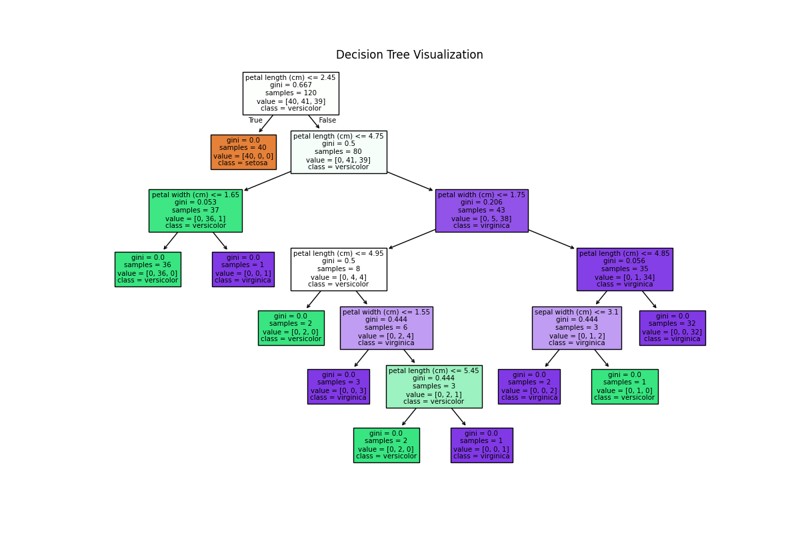

<!-- HEADER BANNER -->


<!-- ANIMATED TAGLINE -->
<p align="center">
  
</p>

<!-- TECH BADGES -->
<p align="center">
  
  
  
  
  
  
  
</p>

---

## 📌 Overview
This project uses the famous **Iris Dataset** to classify flowers into three species:
- **Setosa**
- **Versicolor**
- **Virginica**

The model is trained using a **Decision Tree Classifier**, achieving **100% accuracy** on the test set.

---

## 📊 Dataset Information
| Feature            | Description         |
|--------------------|---------------------|
| Sepal Length (cm)  | Length of sepal     |
| Sepal Width (cm)   | Width of sepal      |
| Petal Length (cm)  | Length of petal     |
| Petal Width (cm)   | Width of petal      |
| Target             | Flower species      |

- **Samples:** 150  
- **Classes:** 3 (Setosa, Versicolor, Virginica)  
- **Source:** UCI Machine Learning Repository

---

## 🚀 How to Run
```bash
# Clone the repository
git clone https://github.com/Rushorgir/iris-flower-classification
cd iris-flower-classification

# Install dependencies
pip install pandas numpy matplotlib seaborn scikit-learn

# Run the script
python iris_classification.py
```
---

## 🖼️ Visualizations
1️⃣ Pairplot
<p align="center">
  
</p>

2️⃣ Decision Tree
<p align="center">
  
</p>

---

<p align="center">
  
</p>
